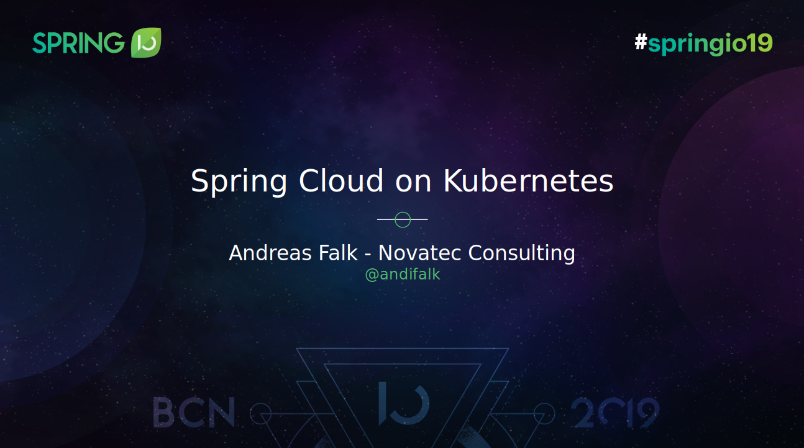

[][1]

# Spring Cloud on Kubernetes @ Spring I/O 2019

Spring Boot and Spring Cloud are great in helping building cloud-native Java or Kotlin applications. 
Using Spring Cloud components like Discovery Service, API Gateway or the Config Server have improved 
the experience in the cloud to a big extent.   
With the rise of Kubernetes, this has changed: Discovery services and configuration/secret management are 
provided “out of the box” here. 

In this talk, you will learn how Spring Cloud Kubernetes integrates with Config Maps and Secrets to 
provide secure configuration to Spring Boot applications in a seamless manner. 
You will also see the interaction of the Spring Cloud DiscoveryClient with the provided 
Discovery Services of Kubernetes. 

This presentation will consist of live coding and demos that will use sample applications build with Spring Boot and Spring Cloud Kubernetes.

This repository contains the complete material for the session at [Spring I/O 2019](https://2019.springio.net/) 
on [Spring Cloud on Kubernetes](https://2019.springio.net/sessions/spring-cloud-on-kubernetes)

## License

Apache 2.0 licensed

Copyright (c) by 2019 Andreas Falk

[1]:http://www.apache.org/licenses/LICENSE-2.0.txt